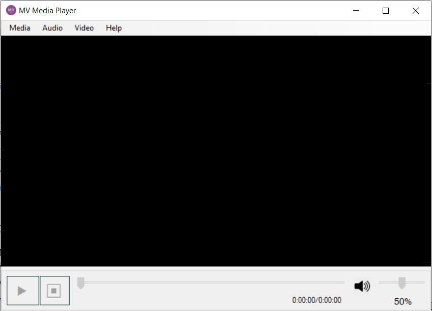
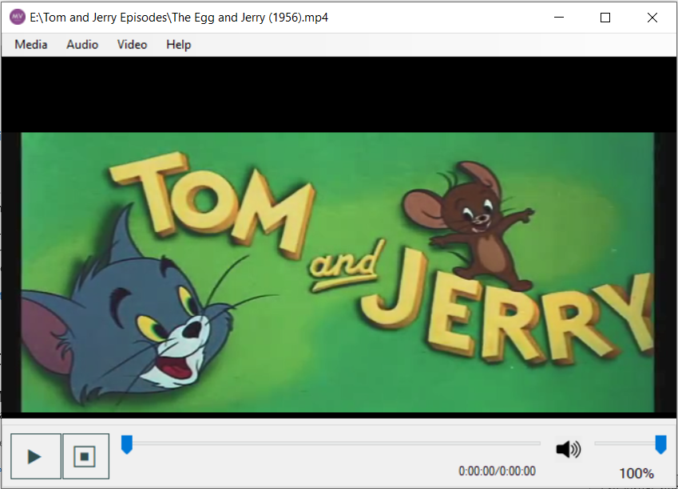

# MV Media Player
MV Media Player is a Windows application created by using C#. It's a media/video player which has basic functionalities like open any video file, play, pause, stop, seek, volume control etc. (created in March, 2018)
# Screenshots

